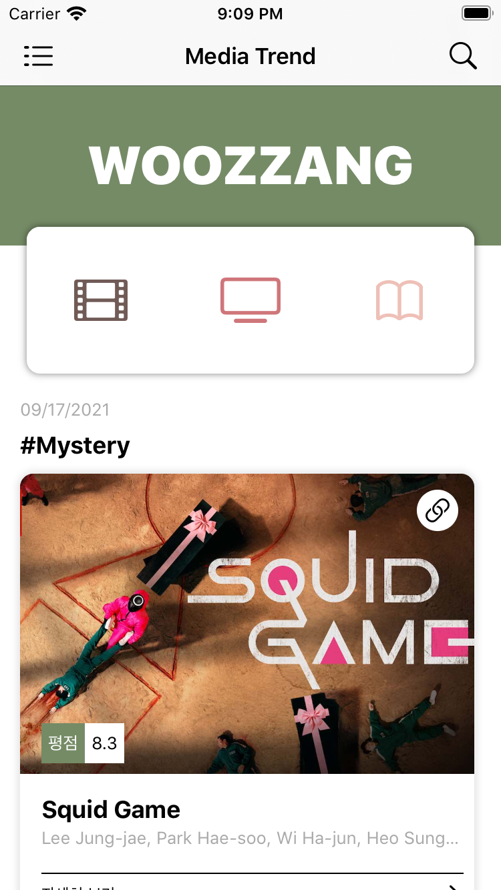
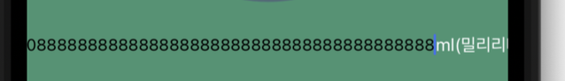
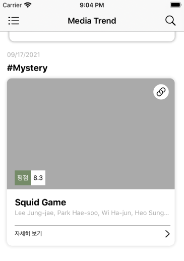

# Trend Media

미디어 트렌드와 관련 상세 정보를 보여주는 앱 🎬
<br /><br />

| TrendMainVC             |  SearchVC | CastingVC |
:-------------------------:|:-------------------------:|:----------------:
 |  | 
<br /><br />
## Index 📇
- [구현기간](#구현-기간)
- [사용 요소 및 개념](#사용-요소-및-개념)
- [의존성](#의존성-(SwiftPM))
- [요구사항](#요구사항)
- [구현 포인트](#구현-포인트)

### 구현 기간

1차 요구사항 - 21.10.19 (약 1일)

<br />

### 사용 요소 및 개념
- **UITableView**
  - `CustomReusableCell`
  - `CustomTableHeaderView`
  - `Self-Sizing-Cell`
<br />
- **UIStackView**
  - `CompressionResistancePriority`
<br /> 
- **UIView & CALayer**
  - `maskToBounds`, `clipToBounds`
  - `ShadowView`
<br />
- **StoryBoards & Xibs**
  - `Storyboard Reference`
    - 아래 두 가지 요구사항을 동시에 충족시키기 위해 사용하였습니다.
      1. 화면 간 전환에 Segue 를 사용한다
      2. 한 화면 당 하나의 스토리보드를 사용한다

### 의존성
 - **`SwiftPM`** : 의존성 관리자
 - **`KingFisher`**
 - **`Alamofire`**

<br /><br />

## 요구사항
### A 화면 ( TrendMainVC )

- 영화 트렌드 정보를 보여주는 화면
- [x]  UIViewController + UIView + UITableView 형태로 구성된 씬
- [x]  샘플 데이터 중 표현하고 싶은 데이터를 자유롭게 셀에 표현
- [x]  셀 디자인은 자유 (단, titlle, genre, poster, rate 라는 4가지 요소는 반드시 사용할 것
<br />

### B화면 ( SearchVC )

- 영화 검색 시 사용하는 화면
- [x]  UIViewController + UISearchBar + UITableView 형태로 구성된 씬
- [x]  A화면의 우측 상단 검색 버튼을 누르면 FullScrenn 방식으로 B 화면이 전환된다
- [x]  B 화면의 왼쪽 상단 닫기 버튼을 누르면, B 화면이 A 화면으로 전환된다
<br />

### C화면 ( CastVC )

- 영화 출연 배우들을 보여주는 화명
- [x]  UIViewController + UITableView 형태로 구성된 씬
- [x]  A 화면의 테이블뷰 셀을 선택하면, Push 방식으로 C화면이 전환
- [x]  우선 임시 데이터로 테이블 뷰 동작 확인
<br /><br />

# 구현 포인트 🤞🏻

### ☑️ 재사용 테이블 뷰 셀

- 스토리보드 내부의 프로토타입 셀 구성 대신  `.xib` 파일로 생성하여 셀을 재사용할 수 있다.
- 테이블 뷰에 register 하는 작업이 추가적으로 필요함
- Reuse Identifier 은 관리를 줄이기 위해 [ 파일명 = 클래스명 = 재사용 식별자 ] 전략으로 간다!!!!!!

```swift
class CastingTableViewCell: UITableViewCell {
  
  static var identifier = "CastingTableViewCell"
  
	// UINib 생성자에 필요. 시맨틱을 주기 위해 계산속성으로 따로 구현했다.
  static var nibName: String {
    
    return identifier
  }

	...
}
```
<br />

### ☑️ 기기 화면에 따른 Label Layout 침범 방지

- 다양한 방법이 있지만 이번엔 `less than equal` 제약으로 trailing 의 최소 여백를 설정
- 요구사항에 적혀있지 않더라도 잡아내야하는 UX 적 고려사항!!!!! ( 배운 내용 🔥 )
<br />

    
<br />

### ☑️ 명시적 segue 연결이 안되는 경우 ( 테이블 뷰 셀 탭시 화면 이동 )

- segue 연결을 [컨트롤 - VC] 간이 아닌 [VC - VC] 간 연결로 구성
- 적절한 메서드에서 `performSegue(withIdentifier:sender:)` 호출
- 문자열 인라인 전달을 제거하기 위해 따로 상수에 segue identifier 설정
<br />

### ☑️  다중계층 View 의 라운드처리 와 그림자
<br />

<br />

- 라운드 처리된 다중 계층 뷰에 그림자를 추어야 했다. 하지만 `clipsToBounds` 상태에서 그림자를 추가할 수는 없다.
- 라운드 처리된 뷰와 여백 제약을 0으로 맞춘 `ShadowView` 를 만들고 이곳에서 그림자를 구현했다.

### ☑️ MaskToBounds 와 ClipsToBounds 차이는?
- 작성 중 🔥